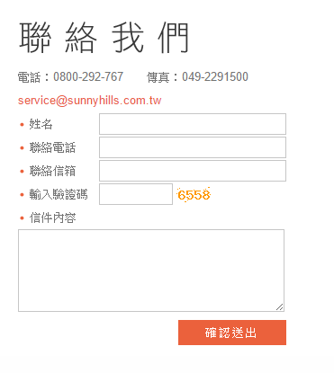

#Longwin

##Front-end

前端網頁的網址：[http://longwin.tw/](http://longwin.tw/)

前端網頁的專案程式碼：[https://github.com/Justinsanity/longwin](https://github.com/Justinsanity/longwin)

這部分是用 GitHub Page (Branch gh-pages)


##Back-end

###Environment:
1. PL：JavaScript/node.js
2. Platform：
    - frontend：github page
    - backend：heroku
    - database：mongoDB  in MongoLab (500MB for free)
          * DB name：longwin
3. MVC Framework：
    - frontend：backbone.js + underscore.js + ways.js
    - backend：express.js
4. Template Engine: Jade
5. Mailer: nodemailer

##檔案結構
(Branch dev)

主要的檔案如下三個：

* app.js：Entry point 和 Router
* db.js：Model
* views/：我用 Jade 來作為排版引擎，跟 HAML 很像
	* views/index.jage：純粹測試與預留的樣版首頁
	* views/mail.jade：這個是預備用來作為『聯絡我們』寄信用的，預計聯絡我們的頁面概念圖如下：<br>
	
	* 	view/order.jade、order2.jade、order3.jade：線上訂購的三個流程頁面

##網站流程

後端網頁的網址在此：[https://longwin.herokuapp.com/](https://longwin.herokuapp.com/)

* 從前端連到後端只有兩個連結：線上訂購、聯絡我們
* 但是直接連線的話，因為我在 app.js 中寫了 `res.redirect('http://longwin.tw');`，所以會被自動倒回前端首頁
* 購物流程：
	1. 線上購物<br>
	
	2. 填寫資料<br>
	
	3. 確認資料(在此可回上一頁修改)<br>
	
	4. 完成訂購(這邊應該就要已經寫入資料庫了)<br>
	

##Router
```JavaScript
/* 直接連根目錄就導回前端首頁 */
app.get('/', function(req, res){
  res.redirect('http://longwin.tw');
});

/* 按下『線上訂購』連過來的第一個頁面 */
app.get('/order', function (req, res) {
  res.render('order', { title: '線上訂購 - 龍吟商行 Longwin'});
});

/* 按下『聯絡我們』連過來的第一個頁面 */
app.get('/mail', function (req, res) {
  res.render('mail', { title: '聯絡我們 - 龍吟商行 Longwin'});
});

/** 線上訂購的第二頁 
 *  第一頁填寫完資料後，會送到第二頁來給使用者檢查
 */
app.post('/order2', function(req, res){
  res.render('order2', { 
    title: '訂單確認 - 龍吟商行 Longwin',
    name: req.body.name,
    goods: req.body.goods,
    count: req.body.count,
    phone: req.body.phone,
    email: req.body.email,
    addr: req.body.addr
  });
});

/** 線上訂購的第三頁(結果顯示頁)
 *  因為已經寫入資料庫 (在下一個 order3 的 post 方法中)
 *  引此直接 render 畫面
 */
app.get('/order3', function(req, res){
    res.render('order3');
});

/** 線上訂購的第三頁(資料處理頁，可視為 controller)
 *  在第二頁按下『確認送出』後，會以 POST 方法先送過來寫入資料庫
 *  如果寫入成功才會以 GET 導向結果頁 order3
 */
app.post('/order3', function(req, res){
    //  title: '完成訂購 - 龍吟商行 Longwin',

    res.status(200).end();

    // write to database
    new Order({
        id: findNextId(),
        name: req.body.name,
        goods: req.body.goods,
        count: req.body.count,
        phone: req.body.phone,
        email: req.body.email,
        addr: req.body.addr,
        time: Date.now()
    }).save(function(err){
        if(err) {
            console.log(err);
            res.status(500).end(); // internal error
            // TODO: send log by npmlog and nodemailer
        }
        else {
            console.log("success")
            res.status(200).end(); //OK 
            // TODO: send a confirmation to inform a new order made by nodemailer
        }
    });
});

/* for 訂單管理 only (聯絡我們的信會直接寄到信箱) 
app.get('/admin', function(){
	// TODO
});
*/

```

### Customized Functions in apps
```JavaScript
/**
 * logger：用來統一做 log 的格式
 * @ param code: logger code 代表 log type
 * @ param message: 呼叫 logger 的地方可能傳入的錯誤訊息
 */
var logger = function(code, message){
    /**
     * code:
     * 0 - (tmp reserved)
     * 1 - new order made
     * 2 - order system error
     */
     var subject = "";
     switch(code){
        case 0:
            subject = "All is well";
            break;
        case 1:
            subject = "New order made";
            break;
        case 2:
            subject = "Order system error";
            break;
        default:
            subject = "should not in here";
            break;
     }
     
     var transporter = mailer.createTransport();
     transporter.sendMail({
         from: 'longwin_system',
         to: 'fbukevin@gmail.com',
         subject: subject,
         text: message
    });
}

/**
 * findNextId：用來產生下一個寫入資料庫時的 primary key (自動遞增的 id 等)
 */

var findNextId = function(){    
   /* TODO: a function for querying the maximun id in index and +1 */
   Order.findOne{ id: }
   //return max + 1;
}
```
* 這部分可能之後要跟 Router 都各自拆出去一個 JavaScript 檔案

##Model

主要有兩個 table (暫時的，實際需求要再跟廠商討論)

1. order：用來儲存訂單
2. mail：用來儲存客戶的郵件(這部分可以先不用做，所以我先 comment 起來了)

###order
```JavaScript
var order = new schema({
    id: {type: Number, unique: true}, 
    name: String,
    goods: String,
    count: Number,
    phone: String,
    email: String,  // 確認信用的，可空
    addr: String,
    time: {type: Date, default: Date.now()}
});
```

###mail
```
var mail = new schema({
    id: {type: Number, unique: true},
    name: String,
    content: String,
    time: {type: Date, default: Date.now()},
    mail: String           // 回覆用的，可空(聯絡資料可能已填寫在 content)
});
```

##Package
* MongoDB：資料庫
* Jade：排版引擎
* Nodemailer：用來實現發信功能
* npmlog：用來做 logger

#Heroku 
* ID: fbukevin@gmail.com
* Password: old man

###登入後


###點選 longwin


Heroku 可以直接連接 GitHub 的網頁專案來佈署，不過我花了點時間才沒 error，一個 Heroku app 對應一個 Git Repo *Branch*，我選擇了每次推上一個新的 commit 到 GitHub 的 master branch 就會自動重新佈署網站，可以按 *Deploy* 那邊設定要連接的 branch 和切換到 *Activity* 看建置紀錄。

###Deploy


###Activity


Heroku 可以加上 Add-on，我已經加上了，但 model 還沒有上去連接過(TODO)，可以參考[waiting list 發佈到 heroku 的筆記](public/doc/waiting_list_to_heroku.docx)

基本上掛上 add-on 和寫好 model 就可以成功連線資料庫了，MongoLab 的資料庫可以透過 ssh 連線


###Query

